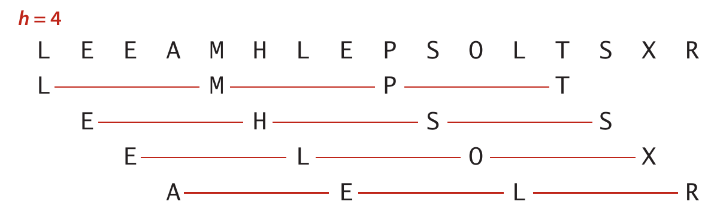
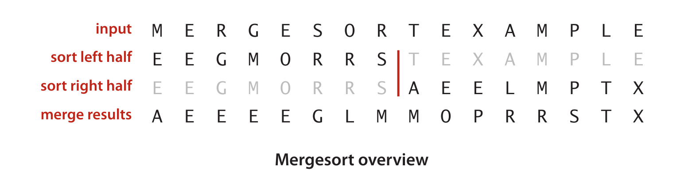
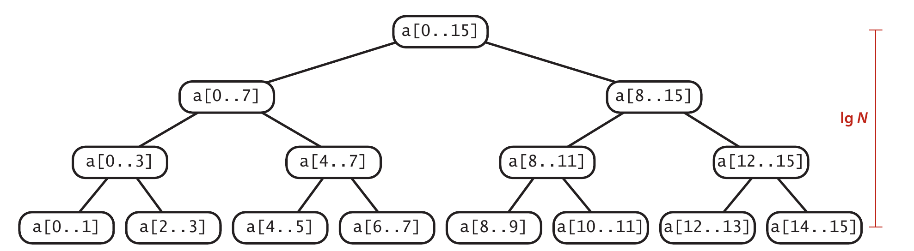
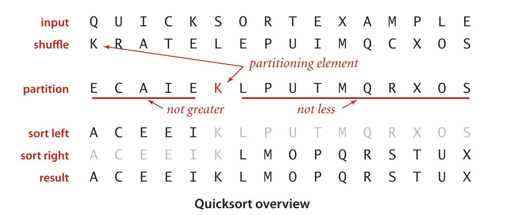
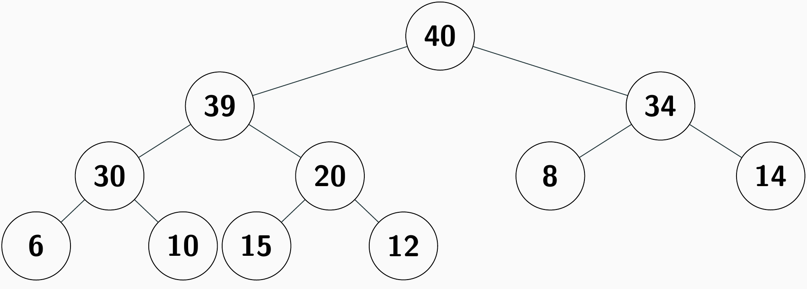
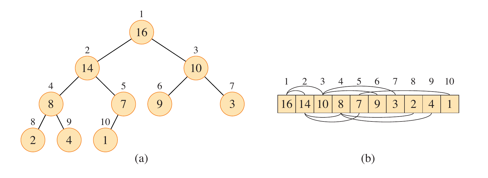

# 第十章：排序

> [!NOTE]
> 排序是计算机科学中的一个基本问题，是算法设计和分析的重要领域。排序的性能理论分析的很多细节超出本门课程的范围，我们这里弱化对其平均复杂度的分析。

- 很多简单的排序算法（如插入排序）的时间复杂度是 $O(N^2)$ ，适用于小规模数据。
- 高效的排序算法（如快速排序、归并排序）的时间复杂度是 $O(N \log N)$ ，适用于大规模数据。
- 对于基于比较的排序算法， $O(N \log N)$ 是最优的时间复杂度。

为了简化讨论，下面我们仅仅考虑整数 `key`，而不考虑更通用的 `key-value` 形式，并认为 `key` 是唯一的。

在学习排序算法的时候，可以借助下面的工具方法，检查一个数组是否已经排序：

```c
#include <stdbool.h>

bool is_sorted(int a[], size_t N) {
  for (size_t i = 1; i < N; i++) {
    if (a[i] < a[i - 1]) return false;
  }
  return true;
}
```

此外，为了更准确的描述其复杂度，我们在大O表示中尽可能包含系数。

## 选择排序（Selection Sort）

每次选择剩余元素中最小的一个，放到已排序序列的末尾。

```c
void swap(int *a, int *b) {
  int temp = *a;
  *a = *b;
  *b = temp;
}

void selection_sort(int a[], size_t N) {
  for (size_t i = 0; i < N - 1; i++) {
    size_t min_index = i;
    // 选择剩余元素中最小的一个
    for (size_t j = i + 1; j < N; j++) {
        if (a[j] < a[min_index]) min_index = j;
    }
    // 将最小元素放到已排序序列的末尾（交换）
    swap(&a[i], &a[min_index]);
  }
}
```

选择排序需要 $O(N^2/2)$ 次比较和 $O(N)$ 次交换，时间复杂度为 $O(N^2)$ 。

不难发现，**选择排序的性能与输入数据的初始状态无关**，无论是已经排序、逆序还是随机，时间复杂度都是 $O(N^2)$ ；而很多排序算法（如插入排序）在已经排序的情况下可以达到 $O(N)$ 的时间复杂度。

## 插入排序（Insertion Sort）


插入排序的过程和我们打牌时整理手牌的过程类似：每次从未排序的部分取出一个元素，插入到已排序的部分的正确位置。

```c
void insertion_sort(int a[], size_t N) {
  for (size_t i = 1; i < N; i++) {
    int key = a[i];
    size_t j = i;
    // 将 key 插入到已排序部分的正确位置
    while (j > 0 && a[j - 1] > key) {
      a[j] = a[j - 1]; // 向右移动元素
      j--;
    }
    a[j] = key; // 插入 key
  }
}
```

这里的重点是：每次 `for` 循环迭代时，`a[0..i-1]` 是已经排序的部分，而 `a[i]` 是当前要插入的元素。通过内层的 `while` 循环，我们将 `key` 插入到正确的位置。

- 最坏情况下，有 $O(N^2/2)$ 次比较和 $O(N^2/2)$ 次移动。复杂度是 $O(N^2)$ 。
- 最好情况下（已经排序），有 $O(N)$ 次比较和 $O(0)$ 次移动。复杂度是 $O(N)$ 。
- 平均情况下，有 $O(N^2/4)$ 次比较和 $O(N^2/4)$ 次移动。复杂度是 $O(N^2)$ 。

此外，可以统一把上述移动操作和最后的插入操作看成一次交互操作，这样代码就更简洁了（但性能稍差）:

```c
void insertion_sort(int a[], size_t N) {
    for (size_t i = 1; i < N; i++) {
        for (size_t j = i; j > 0 && a[j - 1] > a[j]; j--) {
            swap(&a[j], &a[j - 1]);
        }
    }
}
```

> [!TIP]
> 在部分有序的情况下，插入排序性能很好。所以，在一些排序算法（如归并排序）的实现中，当子数组的大小小于某个阈值时，会使用插入排序来优化性能。

### 简单排序算法的性能分析（Low Bound）

在数组中，如果有序对 $(i, j)$ 满足 $i < j$ 且 $A[i] > A[j]$ ，则称 $(i, j)$ 是一个 **逆序对** (inversion)。

> [!TIP]
> 逆序对的数量可以用来衡量一个数组的无序程度。对于一个长度为 $N$ 的数组，平均逆序对的数量是 $N(N-1)/4$ ，最坏情况下（完全逆序）有 $N(N-1)/2$ 个逆序对。

基于上面的定义，任何基于交换相邻元素的排序算法（如插入排序）在平均情况下需要 $O(N^2)$ 的时间复杂度，因为它需要处理平均 $N(N-1)/4$ 个逆序对；注意，此时 $N^2$ 是上界，也是下界（low bound）。

另外一个简单的排序算法是冒泡排序（Bubble Sort），它也是基于交换相邻元素的排序算法，性能分析同样适用。

```c
void bubble_sort(int a[], size_t N) {
  for (size_t i = 0; i < N - 1; i++) {
    // 每一轮将当前未排序部分的最大元素移到末尾
    for (size_t j = 0; j < N - 1 - i; j++) {
      if (a[j] > a[j + 1]) {
        swap(&a[j], &a[j + 1]);
      }
    }
  }
}
```

## 折半插入排序（Binary Insertion Sort）

这是插入排序的一个简单优化：在插入元素时，使用二分查找来找到正确的插入位置，从而减少比较次数。

## 希尔排序（Shell Sort）

它是插入排序的一种改进，由 Donald Shell 在 1959 年提出。它的一个历史意义在于，它是第一个时间复杂度优于 $O(N^2)$ 的排序算法。其关键扩展是：**允许交互不相邻的元素。**

首先，定义 $h$ -有序（ $h$ -sorted）的概念：如果一个数组满足对于所有的 $i$ ， $A[i] < A[i+h]$ ，则称该数组是 $h$ -有序的。



希尔排序的过程是逐步减小这个 $h$ ，直到 $h=1$ ，此时数组已经是完全有序的了。在实现中，如何选择 $h$ 的序列是一个重要的设计问题，不同的序列会影响算法的性能。比如下面的算法是从 $N/3$ 开始，每次除以 3：

```c
void shell_sort(int a[], size_t N) {
    size_t h = 1;
    // 1, 4, 13, 40, 121, 364, 1093
    while (h < N / 3) {
        h = 3 * h + 1; // 生成 Knuth 序列
    }
    while (h >= 1) {
        for (int i = h; i < N; i++) {
            for (int j = i; j >= h && a[j] < a[j - h]; j -= h) {
                swap(&a[j], &a[j - h]);
            }
        }
        h /= 3;
    }
}
```

希尔排序的时间复杂度分析比较复杂，比如上面的算法的时间复杂度是 $O(N^{1.5})$ 。

## 归并排序（Merge Sort）

本算法基于教材P.65的 `2.5.3` 有序表的归并算法。



它的核心是**分治**（divide and conquer）策略：将数组分成两半，分别排序，然后合并两个有序的子数组。从实现层面，最核心的操作是合并：

```c
void merge(int a[], int aux[], int lo, int mid, int hi)
{
    // 1. 将待合并区间复制到辅助数组
    for (int k = lo; k <= hi; k++) {
        aux[k] = a[k];
    }

    // i 指向左半部分的当前元素
    // j 指向右半部分的当前元素
    int i = lo;
    int j = mid + 1;

    // 2. 将两个有序子数组合并回原数组
    for (int k = lo; k <= hi; k++) {
        if (i > mid) {
            // 左半部分已经用完
            a[k] = aux[j++];
        } else if (j > hi) {
            // 右半部分已经用完
            a[k] = aux[i++];
        } else if (aux[j] < aux[i]) {
            // 右边当前元素较小
            a[k] = aux[j++];
        } else {
            // 左边当前元素较小或相等
            a[k] = aux[i++];
        }
    }
}
```

完整的归并排序一般使用递归实现：

```c
void merge_sort(int a[], int aux[], int lo, int hi) {
    if (lo >= hi) return; // 基线条件：单个元素已经有序
    int mid = lo + (hi - lo) / 2; // 计算中点
    merge_sort(a, aux, lo, mid); // 递归排序左半部分
    merge_sort(a, aux, mid + 1, hi); // 递归排序右半部分
    merge(a, aux, lo, mid, hi); // 合并两个有序子数组
}
```

关于归并排序的性能分析是一个非常有趣的练习，这里不展开细节讨论。可以结合下面的图进行非正式分析：



上面的图中，每个结点要执行一次`merge`操作。这个树有 $n$ 层，显然 $n = logN$ 。在第 $k$ 层，有 $2^k$ 个结点（数组），每个数组的长度是 $2^{n-k}$ ，其合并操作的时间复杂度是 $O(2^{n-k})$ ，所以第 $k$ 层的总时间复杂度是 $O(2^k \cdot 2^{n-k}) = O(2^n) = O(N)$ 。因此，整个归并排序的时间复杂度是 $O(N \log N)$ 。

另外，可以结合教材图10.19理解归并算法的 **自底向上** 的执行过程。

> [!NOTE]
> Python和Java对于对象排序的默认实现是 [TimSort](https://en.wikipedia.org/wiki/Timsort)，它是归并排序和插入排序的混合算法。

> [!NOTE]
> 特别地，在Java中，对于原始类型（如`int`）的排序，使用的是 [Dual-Pivot Quicksort](https://en.wikipedia.org/wiki/Dual-pivot_quicksort)，它是快速排序的一种改进版本。

## 快速排序（Quick Sort）

快速排序也是基于分治策略的排序算法。它的核心思想是：选择一个“基准”（pivot）元素，将数组分成两部分，使得左边的元素都不大于基准，右边的元素都不小于基准，然后递归地对这两部分进行排序。



> 第一步的 `shuffle` 并没有算法必须，但它可以有效地避免在输入数据已经有序或逆序的情况下导致性能退化到 $O(N^2)$ 的情况。

特别的，如何选择基准元素是快速排序性能的关键因素之一。常见的选择方法包括：

- 选择第一个元素作为基准（简单但可能导致性能退化）。
- 选择最后一个元素作为基准（同样简单但可能导致性能退化）。
- 选择随机元素作为基准（可以有效避免性能退化）。
- 选择三个元素的中位数作为基准（可以在一定程度上提高性能）。

从实现层面，快速排序的核心是分区（partition）操作：

```c
size_t partition(int a[], size_t low, size_t high) {
    size_t i = low, j = high + 1;
    int pivot = a[low]; // 选择第一个元素作为基准
    while (true) {
        // 从左向右扫描，找到第一个大于等于基准的元素
        while (a[++i] < pivot) {
            if (i == high) break;
        }
        // 从右向左扫描，找到第一个小于等于基准的元素
        while (a[--j] > pivot) {
            if (j == low) break;
        }
        // 如果扫描指针相遇，分区完成
        if (i >= j) break;
        swap(&a[i], &a[j]); // 交换两个元素
    }
    swap(&a[low], &a[j]); // 将基准元素放到正确的位置
    // with a[lo..j-1] <= a[j] <= a[j+1..hi]
    return j; // 返回基准元素的最终位置
}
```

完整的快速排序实现如下：

```c
void quick_sort(int a[], size_t low, size_t high) {
    if (hi <= low) return; // 基线条件：单个元素已经有序
    size_t pivot_index = partition(a, low, high); // 分区操作
    quick_sort(a, low, pivot_index - 1); // 递归排序左半部分
    quick_sort(a, pivot_index + 1, high); // 递归排序右半部分
}
```

- 最坏情况下（如输入数据已经有序或逆序），快速排序的时间复杂度是 $O(N^2)$ 。但是 `shuffle` 可以有效避免这种情况。
- 平均情况下，快速排序的时间复杂度是 $O(N \log N)$ 。

## 堆排序（Heap Sort）

这是本章中唯一和数据结构相关的排序算法。

它基于**堆**（heap）数据结构，特别是**二叉堆**（binary heap）。堆是一种完全二叉树，满足堆性质：对于最大堆，每个节点的值都不小于其子节点的值；对于最小堆，每个节点的值都不大于其子节点的值。



> 之前 Huffman 编码、Prim算法、Dijkstra算法等都用到了堆数据结构，用于快速地获取最小元素。

堆排序的基本思想是：首先将数组构建成一个最大堆，然后重复以下步骤：将堆顶元素（最大元素）与堆的最后一个元素交换，将堆的大小减一，并对新的堆顶元素进行下沉操作以恢复堆性质。这个过程会将数组排序成升序。

这里的重点是：每次 `delMax` 的时间复杂度是 $O(\log N)$ ，因为需要进行下沉操作；而构建堆的时间复杂度是 $O(N)$ 。因此，整个堆排序的时间复杂度是 $O(N \log N)$ 。

### 实现细节

由于堆是一个完全二叉树，我们可以使用数组来表示它。特别的，为了简化父子节点的计算，通常将堆的索引从 1 开始（即 `heap[1]` 是堆顶元素），这样对于一个节点 `heap[k]`，它的父节点是 `heap[k/2]`，左子节点是 `heap[2k]`，右子节点是 `heap[2k+1]`。



（最大堆的二叉树和数组表示，其中二叉树是概念上的，而数组是实际的存储结构）


### 堆的常见应用

在很多实际问题中，我们并不需要对全部数据进行完整排序，而只关心其中最大的或最小的 k 个元素。例如：

- 从所有学生成绩中找出最高的 10 名；
- 从搜索结果中返回相关度最高的 k 条记录；
- 从日志中找出访问次数最多的 k 个页面；
- 从商品中选出销量最高的 k 个商品；
- 在海量数据中找出最大的 k 个数。（这个场景在大数据中非常常见，即数据是流式到达的）

如果强行排序，时间复杂度是 $O(N \log N)$ ；而使用堆，我们可以在 $O(N \log k)$ 的时间内找到最大的 k 个元素，效率更高。

> 其核心思想是：维护一个大小为 k 的最小堆，保存当前扫描到的最大的 k 个元素。

