# 第7章：图

> [!TIP]
> 无论是中文的“图”，还是英文的“graph”，这个词都是多义的。在数据结构中，我们通常指的是**图论中的图**，而不是函数图像、统计图表等其他类型的图。

> [!CAUTION]
> 从难度角度出发，图是最复杂的数据结构，没有之一。参考经典的《算法导论》，其第三部分是“Data Structures”，第无部分是“Advanced Data Structures”，而整体第六部分都是“Graph Algorithms”。因此，图的算法和数据结构是非常复杂的，需要花费大量时间来理解和掌握。

## 8.1

从8.1节可以看出，图和树比较类似；或者可以说，树是图的一种特殊情况。但图由于其更一般性，其术语也更复杂。从应用角度，教材未充分讨论图的应用场景，这里补充一些常见的图应用（https://ml-digest.com/knowledge-graphs/）：

- **社交网络**：用户之间的关系可以表示为图，节点代表用户，边代表好友关系。
- **交通网络**：城市之间的道路可以表示为图，节点代表城市，
- **函数调用关系**：在程序中，函数之间的调用关系可以表示为图，节点代表函数，边代表调用关系。
- **网页链接**：网页之间的链接关系可以表示为图，节点代表网页，边代表链接关系。

关于边（edge）的种类，实际上有两种常见的异常（anomaly）：

- **自环**（self-loop）：边连接同一个节点，例如A->A。
- **平行边**（parallel）：两个节点之间存在多条边，例如A->B和A->B。

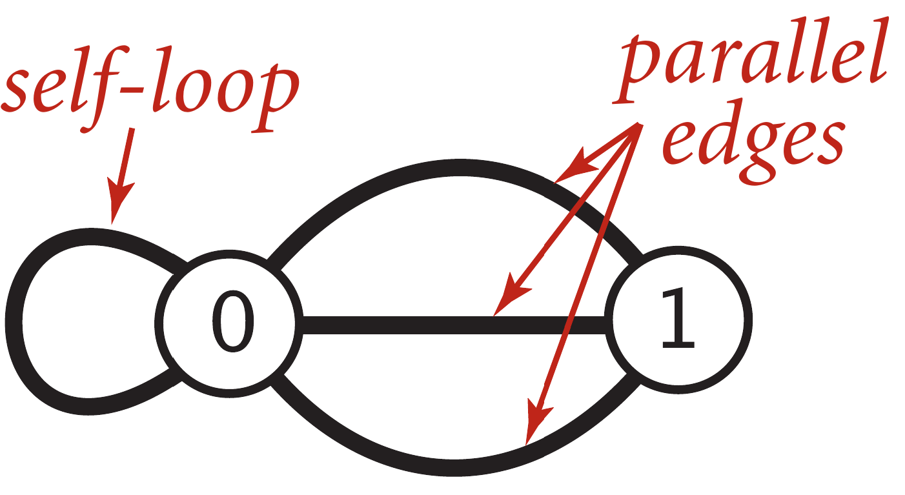

结合下面无向图的示例，理解图的常用术语：

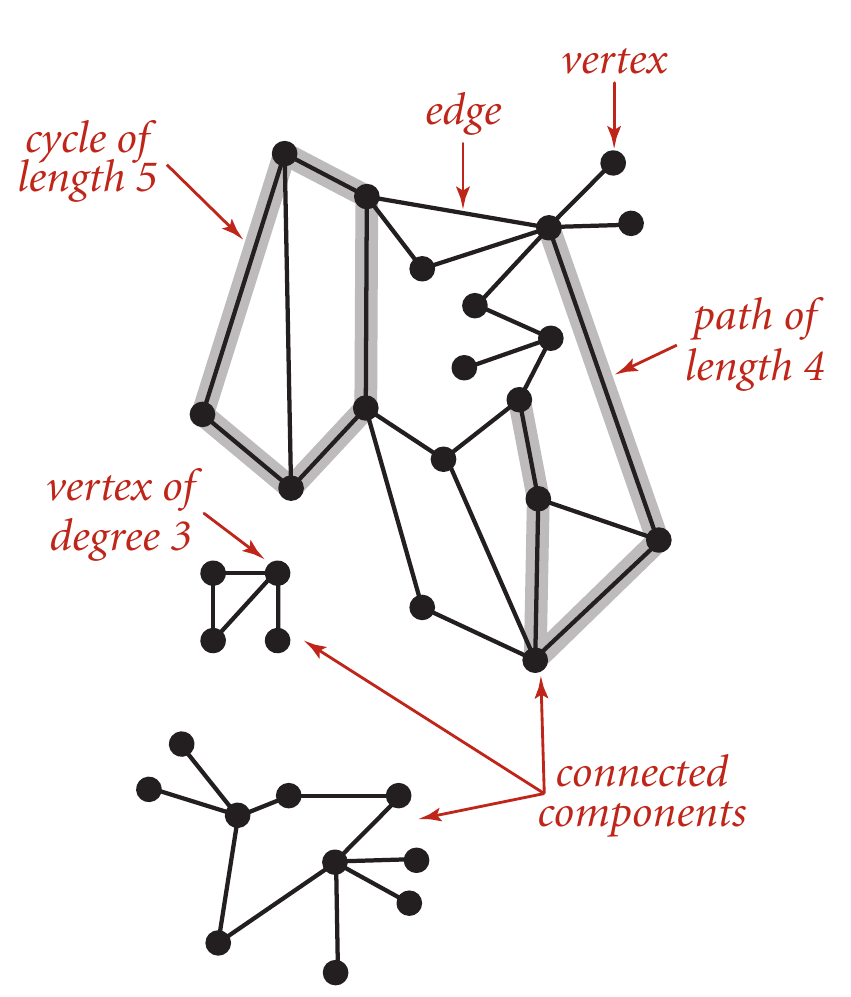

一般情况下，我们都是考虑simple path、simple cycle等，从而在描述的时候经常省略“simple”这个词。

教材中有个概念很模糊，就是**稠密图**（dense graph）和**稀疏图**（sparse graph）。真实情况就是，它们本来就没有严格定义：if $|E|$ is much less than $|V|^2$ , then it is sparse；书中的经验范围 $O(n\log{n})$ 也是正确的。

还有一个术语经常出现，就是**acyclic**，即无环的。特别地，如果是有向图无环，我们称之为**DAG**（Directed Acyclic Graph）。DAG在很多应用中非常重要，例如任务调度、版本控制等。

因此，**A tree is an acyclic connected graph**，即树是一个无环连通图。比如说，当下面任意条件成立的时候，图就是树：

- 图是无环的，并且有n-1条边。
- 图是连通的，并且有n-1条边。

连通分量（connected component）是一个难点。它有多种定义方式（建议参考[词典解释](https://dictionary.cambridge.org/zht/%E8%A9%9E%E5%85%B8/%E8%8B%B1%E8%AA%9E-%E6%BC%A2%E8%AA%9E-%E7%B9%81%E9%AB%94/component)）：

> A component of an undirected graph is a connected subgraph that is not part of any larger connected subgraph. 

> A graph is connected if there is a path from every vertex to every other
vertex in the graph. A graph that is not connected consists of a set of connected components, which are maximal connected subgraphs.

## 8.2

图的表示方法很重要，主要有两种：**邻接矩阵**（adjacency matrix）和**邻接表**（adjacency list，有时直接称为邻接列表）。前者适用于稠密图，后者适用于稀疏图。而现实中大多数图都是稀疏的，因此邻接表更常用。

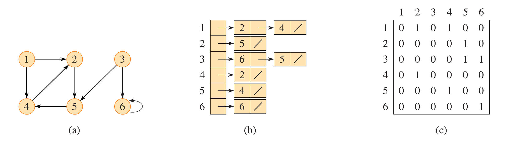

对于无向图，所有邻接表的长度之和等于 $2|E|$ ；对于有向图，所有邻接表的长度之和等于 $|E|$ 。因此，邻接表的空间复杂度是 $O(|V|+|E|)$ ，而邻接矩阵的空间复杂度是 $O(|V|^2)$ 。

不难发现，邻接表的实现很简单，即每个节点对应一个列表，列表中存储该节点的邻居节点。这个列表的具体实现有多种方式，可以是链表、数组，甚至是哈希表、红黑树等，具体选择取决于应用场景和性能需求。当然，很多时候我们都假定邻接表的“表”就是*linked list*。下面通过链表的方式举例：

```c
// 邻接表中每个元素表示一个边，包含一个邻居节点ID和指向下一个边的指针
typedef struct Edge {
  int vertex;
  struct Edge *next;
} Edge;

// 邻接表本身通过首节点表示，size可选
typedef struct {
  Edge *head;
  int size;
} List;

typedef struct {
  int V;
  int E;
  List *adj; // 邻接表数组，adj[i]表示节点i的邻接表
} Graph;
```

这样添加边的时候就是在对应链表上执行头插法，比教材中晦涩的代码更好理解。

如果需要记录权重，可以在 `Edge` 结构体中添加一个权重字段，其他代码几乎不变。

```c
typedef struct Edge {
  int vertex;
  double weight;
  struct Edge *next;
} Edge;
```


| 数据结构 | 空间复杂度 | 添加边的时间复杂度 | 检查 w 是否与 v 相邻 |
|---|---|---|---|
| 邻接矩阵 | $O(\lvert V\rvert^2)$ | $O(1)$ | $O(1)$ |
| 邻接表 | $O(\lvert V\rvert + \lvert E\rvert)$ | $O(1)$ | $O(\deg(v))$ |

## 8.3
图的搜索和遍历是图算法的基础，是本章的重点。对图搜索的常见应用包括：**路径搜索**（寻找图中两点之间的路径）。

> [“凯文·贝肯六度法则”](https://en.wikipedia.org/wiki/Six_Degrees_of_Kevin_Bacon)或称“贝肯定律”，是一种社交游戏：玩家轮流选择两位演员，通过他们共同出演过的电影来建立这两位演员之间的联系，不断重复这个过程，试图找到连接美国著名演员凯文·贝肯的最短路径。这个游戏的假设是——任何参与好莱坞电影行业的人，都可以通过他们在电影中的角色，在六步之内与凯文·贝肯建立联系。游戏名称借鉴了“六度分隔理论”，这一概念认为地球上任意两个人之间，最多只需通过六层人际关系就能建立联系。

在引入具体的算法之前，我们可以讨论**通用的图检索/遍历算法**。

问题定义：

>[!NOTE]
> 输入：无向图或有向图 $G=(V,E)$ ，起点 $s \in V$ 。
>
> 目标： $V$ 中所有与 $s$ 可达的顶点。

算法描述：

（最终的**完成状态**是：当且仅当一个顶点被标记为”已探索“/”已访问“，它才是从 $s$ 可达的顶点。）


```
将 s 标记为已访问，所有其他顶点标记为未访问
while 存在一条边 (u, w) ∈ E，且u已访问，w未访问：
    选择这样的边 (u, w) // 不够明确
    将 w 标记为已访问
```

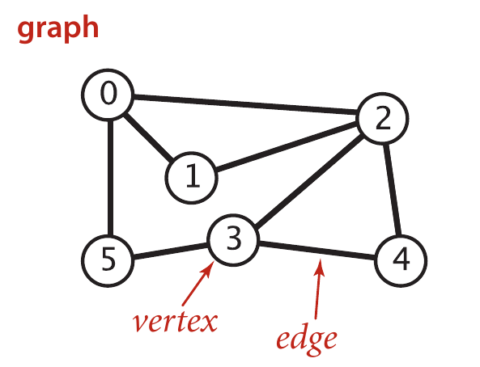

显然，在while循环的一次迭代中可能有多条边(u, w)可供选择，而广度优先搜索（BFS）和深度优先搜索（DFS）就是两种不同的具体选择策略。

### 深度优先搜索（DFS）

深度优先搜索（DFS）总是从最近发现的顶点开始向前搜索，直到无法继续（“走投无路”）为止，然后回退并继续搜索其他路径。DFS可以使用递归或显式的栈来实现。

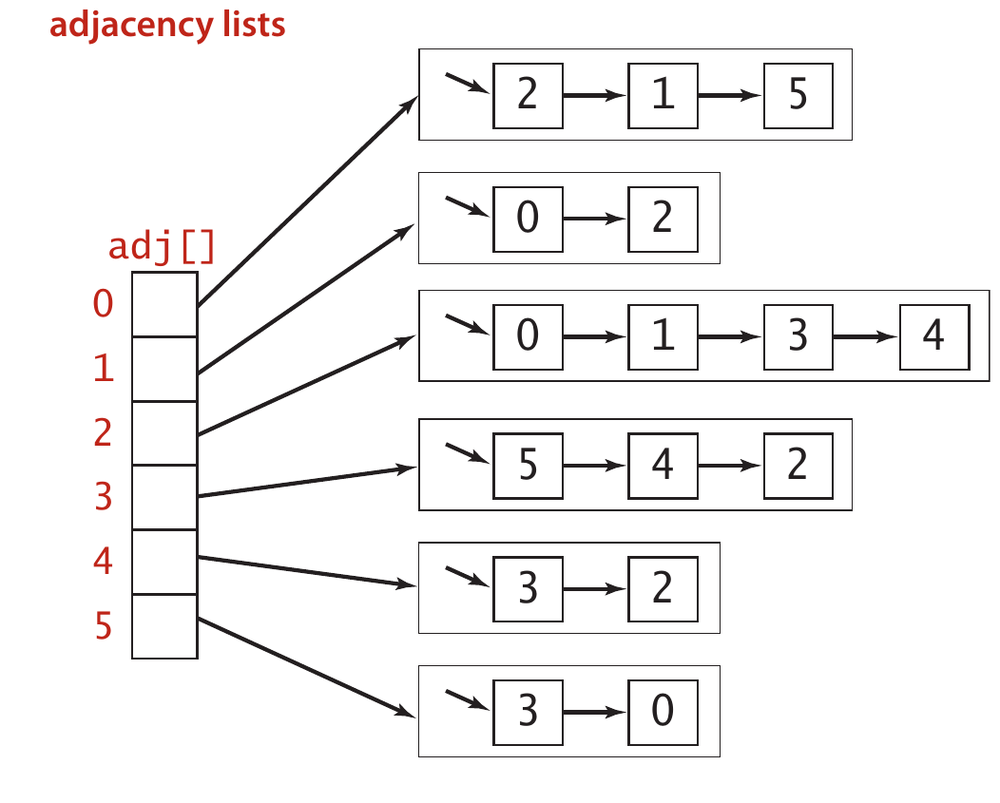

递归版本的DFS实现（初始调用为`DFS(G, s)`）：

```
将 s 标记为已访问，所有其他顶点标记为未访问
while s邻接表的边(s, v)：
    if v未访问：
        递归调用DFS(G, v)
```

对应的C语言代码也很简单：

```c
void graph_dfs_recursive(const Graph *g, int v, bool *visited) {
  visited[v] = true;
  printf(" %d", v);

  int size;
  int *neighbors = adj(g, v, &size);
  for (int i = 0; i < size; i++) {
    int w = neighbors[i];
    if (!visited[w]) {
      graph_dfs_recursive(g, w, visited);
    }
  }

  free(neighbors);
}

void graph_dfs(const Graph *g, int start) {
  if (g == NULL || start < 0 || start >= g->V) {
    return;
  }
  // 申请 g->V 个 bool 类型的空间，并且全部初始化为 false： https://cppreference.com/c/memory/calloc
  bool *visited = calloc(g->V, sizeof(bool));

  printf("DFS from %d:", start);
  graph_dfs_recursive(g, start, visited);
  printf("\n");

  free(visited);
}
```

上述引入adj()是为了简化代码。为了提升程序效率，也可以类似教材中一样维护当前访问的邻接表的位置，从而避免每次都从头遍历邻接表（参考`graph_dfs2.c`）。

```c
void graph_dfs_recursive(const Graph *g, int v, bool *visited) {
  visited[v] = true;
  printf(" %d", v);

  Edge *curr = g->adj[v].head;
  while (curr != NULL) {
    int w = curr->vertex;
    if (!visited[w]) {
      graph_dfs_recursive(g, w, visited);
    }
    curr = curr->next;
  }
}
```

DFS的时间复杂度是 $O(|V| + |E|)$ ，因为每个顶点和每条边都被访问一次。

DFS可以回答以下问题：

- **连通性**：DFS可以用来检查图是否连通，或者找到图的所有连通分量。
- **路径存在性**：DFS可以用来检查从一个顶点到另一个顶点是否存在路径。

如果要记录路径，可以在DFS中维护一个父节点数组，记录每个节点的前驱节点。

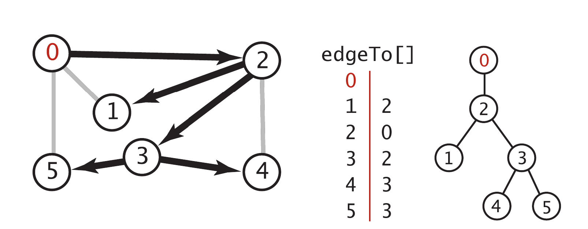

### 广度优先搜索（BFS）
BFS按照与起点的距离（即边的数量）逐层访问顶点。BFS使用一个队列来实现。

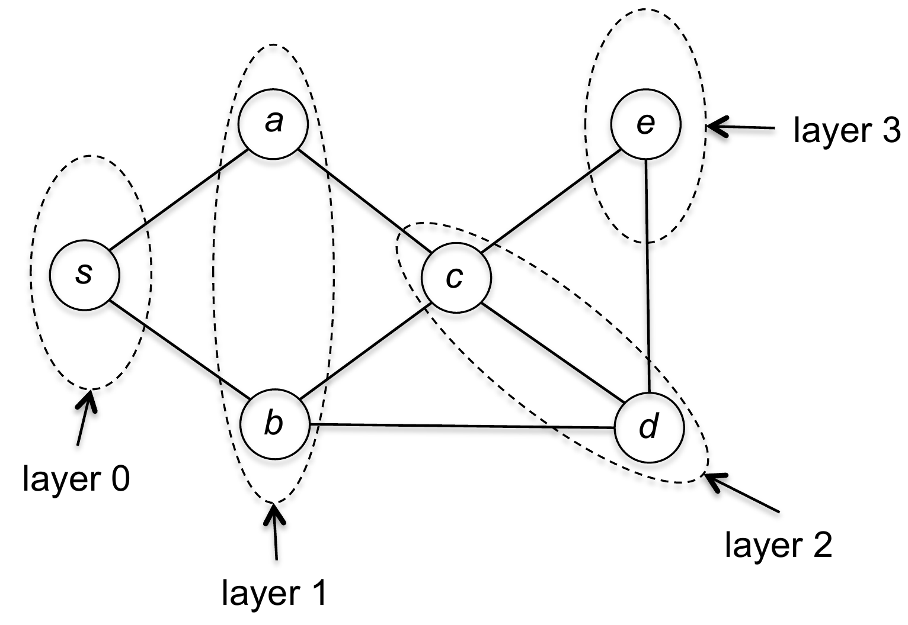

BFS的实现：

```
将 s 标记为已访问，所有其他顶点标记为未访问
创建一个空队列 Q
将 s 入队 Q（即Q.enqueue(s)）
while Q 不为空：
    u = Q.dequeue()
    for 每条边 (u, w) ∈ E：
        if w未访问：
            将 w 标记为已访问
            将 w 入队 Q（即Q.enqueue(w)）
```

BFS的时间复杂度也是 $O(|V| + |E|)$ ，因为每个顶点和每条边都被访问一次。

```c
void graph_bfs(const Graph *g, int start) {
  if (g == NULL || start < 0 || start >= g->V) {
    return;
  }

  bool *visited = calloc(g->V, sizeof(bool));
  Queue *q = queue_init();

  visited[start] = true;
  queue_enq(q, start);

  printf("BFS from %d:", start);

  int v;
  while (queue_deq(q, &v)) {
    printf(" %d", v);

    int size;
    int *neighbors = adj(g, v, &size);
    for (int i = 0; i < size; i++) {
      int w = neighbors[i];
      if (!visited[w]) {
        visited[w] = true;
        queue_enq(q, w);
      }
    }
    free(neighbors);
  }

  printf("\n");

  queue_destroy(q);
  free(visited);
}
```

类似的，引入`adj()`是为了简化代码。如果邻接表的实现是链表，可以直接遍历链表来访问邻居节点，从而避免每次都创建一个新的邻居数组（参考`graph_bfs2.c`）。

```c
  int v;
  while (queue_deq(q, &v)) {
    printf(" %d", v);

    Edge *curr = g->adj[v].head;
    while (curr != NULL) {
      int w = curr->vertex;
      if (!visited[w]) {
        visited[w] = true;
        queue_enq(q, w);
      }
      curr = curr->next;
    }
  }
```

BFS的独到之处在于，只需要添加额外几行代码，就能计算出**最短路径的长度**。


```
将 s 标记为已访问，所有其他顶点标记为未访问
l(s) = 0, 对其余v != s, l(v) = ∞
创建一个空队列 Q
将 s 入队 Q（即Q.enqueue(s)）
while Q 不为空：
    u = Q.dequeue()
    for 每条边 (u, w) ∈ E：
        if w未访问：
            将 w 标记为已访问
            l(w) = l(u) + 1
            将 w 入队 Q（即Q.enqueue(w)）
```

## 8.4

图的生成树（spanning tree）是一个包含图中所有顶点的树：生成树的边数为 $|V|-1$ ，并且是一个连通子图。

最小生成树常被缩写成MST；其中M好理解，重点是理解T和S。

- **Tree**：它是无环的。
- **Spanning**：它包含图中的所有顶点。
- **Minimum**：它的总权重最小。

为了方便描述，我们假设：

- **图是无向的**。有向图更加复杂，Prim算法和Kruskal算法都不适用。
- **图是连通的**。如果不连通，就没有MST。这种情况下，可以得到每个连通分量的MST，或者得到一个生成森林（spanning forest）。
- **权重是唯一的**。如果权重不唯一，可能会有多棵MST。

8.4.2小节的作用不大，可以忽略。

本节的重点是Prim算法和Kruskal算法。从步骤层面，这两个算法都很简单，这里主要从算法思想方面进行分析。

首先回顾树的两个重要性质：1）添加一条边会形成一个环；2）删除一条边会使树变得不连通。这两者性质是得到MST的关键。

图的割（Cut）是指将图的顶点集合划分成两个不相交的子集所形成的边的集合。割的交叉边（crossing edge）是指连接其中一个集合中的顶点与另一个集合中的顶点的边。


>[!NOTE]
> **引理**：给定带权图中的任意一个割，其所有交叉边中权重最小的那条边，必然属于该图的最小生成树（MST）。


>[!NOTE]
> **证明**：设 $e$ 为权重最小的交叉边，并设 $T$ 为最小生成树（MST）。我们采用反证法进行证明。假设 $T$ 中不包含边 $e$ 。现在考虑将边 $e$ 添加到 $T$ 中所构成的图。这个图中会产生一个包含 $e$ 的环，并且该环必然包含至少一条其他的交叉边（假设记为 $f$ ）。由于 $e$ 是权重最小的交叉边，且所有边的权重各不相同，因此 $f$ 的权重必然高于 $e$ 。此时，我们可以通过删除边 $f$ 并加入边 $e$ ，得到一棵总权重严格更小的生成树，这与之前假设 $T$ 是最小生成树（即其具有最小性）相矛盾。

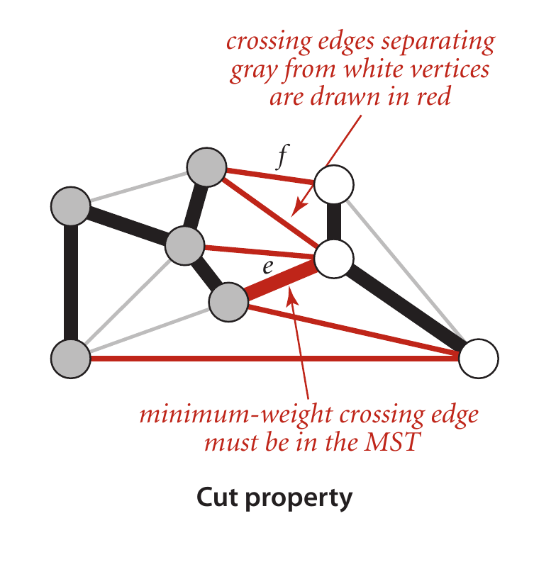

因此，MST的 **[贪心](https://en.wikipedia.org/wiki/Greedy_algorithm)** 算法都是基于上述 Cut Property 来设计。具体的只是 Cut 的维护及找到最小交叉边的方式不同。

## Prim算法的复杂度

教材中提到，Prim算法的时间复杂度是 $O(|V|^2)$ ，这对于稠密图来说是合理的，但对于稀疏图来说效率较低。实际上，Prim算法可以通过使用优先队列（priority queue）来优化到 $O(|E| \log |V|)$ ，这对于稀疏图来说是更合适的。

如果不考虑优化问题，Prim的实现非常简单，下面代码的时间复杂度是 $O(|V||E|)$ 。

```c
void graph_prim(const Graph *g, int start) {
  if (g == NULL || start < 0 || start >= g->V) {
    return;
  }

  bool *visited = calloc(g->V, sizeof(bool));
  double total_weight = 0.0;
  int edge_count = 0;

  visited[start] = true;

  printf("Prim MST from %d:\n", start);

  while (edge_count < g->V - 1) {
    int best_from = -1;
    int best_to = -1;
    double best_weight = DBL_MAX;

    // 遍历所有的边
    for (int v = 0; v < g->V; v++) {
      if (!visited[v]) {
        continue;
      }

      Edge *curr = g->adj[v].head;
      while (curr != NULL) {
        int w = curr->vertex;
        // 要求w未访问，但是v已经访问。这里的“访问”是指已经加入MST了
        if (!visited[w] && curr->weight < best_weight) {
          best_from = v;
          best_to = w;
          best_weight = curr->weight;
        }
        curr = curr->next;
      }
    }

    printf("%d - %d: %.2f\n", best_from, best_to, best_weight);
    visited[best_to] = true;
    total_weight += best_weight;
    edge_count++;
  }

  if (edge_count == g->V - 1) {
    printf("total weight: %.2f\n", total_weight);
  }

  free(visited);
}
```
上述需要每次都检查所有的边。一个优化是（即教材中）维护一个`key[]`数组，表示从已经添加到MST中的顶点到未添加的顶点的最小边权重，这样每次只需要检查`key[]`数组来找到最小交叉边。

- `key[v]`：当前把顶点 `v` 接入 MST 的最小边权重
- `from[v]`：这条最小边来自哪个已加入 `MST` 的顶点，用来打印边

```c
// 不使用堆。每轮线性扫描 key 选点，整体复杂度为 O(V^2 + E)，即 O(V^2)。
void graph_prim2(const Graph *g, int start) {
  if (g == NULL || start < 0 || start >= g->V) {
    return;
  }

  bool *visited = calloc(g->V, sizeof(bool));
  double *key = malloc(sizeof(double) * g->V);
  int *from = malloc(sizeof(int) * g->V);
  double total_weight = 0.0;

  for (int v = 0; v < g->V; v++) {
    key[v] = DBL_MAX;
    from[v] = -1;
  }
  key[start] = 0.0;

  printf("Prim MST from %d:\n", start);

  for (int i = 0; i < g->V; i++) {
    int v = min_key_vertex(g, key, visited);
    visited[v] = true;

    if (v != start) {
      printf("%d - %d: %.2f\n", from[v], v, key[v]);
      total_weight += key[v];
    }

    Edge *curr = g->adj[v].head;
    while (curr != NULL) {
      int w = curr->vertex;
      if (!visited[w] && curr->weight < key[w]) {
        key[w] = curr->weight;
        from[w] = v;
      }
      curr = curr->next;
    }
  }

  printf("total weight: %.2f\n", total_weight);

  free(visited);
  free(key);
  free(from);
}
```

进一步，使用heap可以加速`min_key_vertex()`函数的实现。

## 8.5

>[!NOTE]
> 给定一个全权有向图（edge-weighted digraph）和一个起点 $s$ ，支持查询：是否存在从 $s$ 到目标顶点 $t$ 的（有向）路径；如果存在，求出从 $s$ 到 $t$ 的最短路径。


因为我们考虑的是有向图，所以先要表示**DirectedEdge**。之前我们的定义是：

```c
typedef struct Edge {
  int vertex;
  double weight;
  struct Edge *next;
} Edge;

typedef struct {
  Edge *head;
  int size;
} List;

typedef struct {
  int V;
  int E;
  List *adj;
} Graph;
```

可以发现，`Edge`没有区分起点和终点，此时`vertex`认为是终点，而起点由邻接表的索引决定。为了简化代码实现，我们可以直接在`Edge`中添加一个`from`字段来表示起点，这样就不需要依赖邻接表的索引了。

```c
typedef struct {
  int from;
  int to;
  double weight;
} DirectedEdge;

typedef struct AdjNode {
  DirectedEdge edge;
  struct AdjNode *next;
} AdjNode;

typedef struct {
  AdjNode *head;
  int size;
} List;

typedef struct {
  int V;
  int E;
  List *adj;
} EdgeWeightedDigraph;
```

为了表达**最短路径**，我们可以引入`edgeTo[]`数组，表示从起点到每个顶点的最后一条边，这样就可以通过回溯`edgeTo[]`数组来构建路径；此外，还需要一个`distTo[]`数组，表示从起点到每个顶点的最短路径长度。

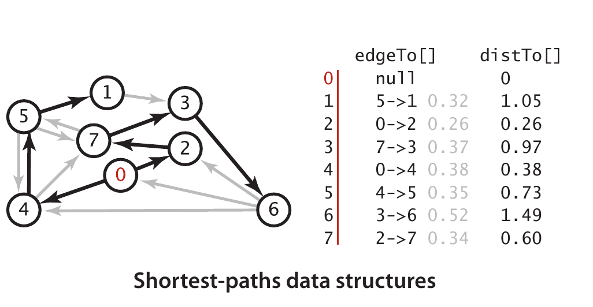

特别地，`edgeTo[s]`可以设置为`NULL`，表示起点没有前驱边；`distTo[s]`可以设置为0，表示起点到自己的距离为0。

### 松弛（Relaxation）
最短路径算法的核心操作是**松弛**（relaxation）。


>[!TIP]
> 松弛边<v, w>（ $v \rightarrow w$ ）表示去检测从 $s$ 到 $w$ 的最短路径是否经过 $v$ （即 $s \rightarrow v \rightarrow w$ ）。如果经过 $v$ 的路径更短，那么就更新`distTo[w]`和`edgeTo[w]`。

伪代码如下：

```
void relax(DirectedEdge e) {
  int v = e.from;
  int w = e.to;
  if (distTo[v] + e.weight < distTo[w]) {
    distTo[w] = distTo[v] + e.weight;
    edgeTo[w] = e;
  }
}
```

>[!TIP]
> 可以把当前路径想象成一根橡皮筋。如果两个顶点之间当前的路径比较长，就像橡皮筋被拉得很紧。后来我们发现另一条更短的路径，那么这根橡皮筋就不需要拉那么长了，可以“放松”一些。

对顶点的**松弛**就是对所有以该顶点为起点的边（即所在邻居）进行松弛。

### Dijkstra算法（单源最短路径）

Dijkstra算法要求是非负权重。为了方便介绍，可以引入**最短路径树**（Shortest Path Tree, SPT）的概念，它是从起点出发的一个树，包含了所有从起点可达的顶点，并且每个顶点的路径都是最短的。Dijkstra算法实际上就是在构建这个最短路径树。

整体上，Dijkstra算法和Prim算法非常相似：

- 初始化时，`distTo[s]`位置为0，而其他`distTo[]`是无穷大。
- 每一轮从尚未加入 SPT 的顶点中选择 `distTo[]` 最小的顶点 v，将其加入 SPT。
- 然后松弛 v 的所有出边（会修改`distTo[]`）。
- 当所有可达顶点都已加入 SPT，或者剩余未加入 SPT 的顶点的 `distTo[]` 均为正无穷时，算法结束。

显然，每次都要选择**最小的**，因此需要使用优先级队列（最小堆）来实现，算法的时间复杂度是 $O(|E| \log |V|)$ ；如果不用优化，直接线性扫描`distTo[]`数组来选择最小的顶点，那么时间复杂度是 $O(|V|^2)$ 。这和Prim算法的分析一致。

```
1   function Dijkstra(Graph, source):
2       Q ← Queue storing vertex priority
3       
4       dist[source] ← 0                          // Initialization
5       Q.add_with_priority(source, 0)            // associated priority equals dist[·]
6
7       for each vertex v in Graph.Vertices:
8           if v ≠ source
9               prev[v] ← UNDEFINED               // Predecessor of v
10              dist[v] ← INFINITY                // Unknown distance from source to v
11              Q.add_with_priority(v, INFINITY)
12
13
14      while Q is not empty:                     // The main loop
15          u ← Q.extract_min()                   // Remove and return best vertex
16          for each edge (u, v) :                // Go through all v neighbors of u
17              alt ← dist[u] + Graph.Distance(u,v)
18              if alt < dist[v]:
19                  prev[v] ← u
20                  dist[v] ← alt
21                  Q.decrease_priority(v, alt)
22
23      return (dist, prev)
```

（可以发现，在实现中并不需要直接维护SPT树，Q本身只包含未确定距离的顶点（非SPT树）；而`prev[]`数组则可以用来回溯路径。）


```
What is the shortest way to travel from Rotterdam to Groningen, in general: from given city to given city. It is the algorithm for the shortest path, which I designed in about twenty minutes. One morning I was shopping in Amsterdam with my young fiancée, and tired, we sat down on the café terrace to drink a cup of coffee and I was just thinking about whether I could do this, and I then designed the algorithm for the shortest path. As I said, it was a twenty-minute invention. In fact, it was published in '59, three years later. The publication is still readable, it is, in fact, quite nice. One of the reasons that it is so nice was that I designed it without pencil and paper. I learned later that one of the advantages of designing without pencil and paper is that you are almost forced to avoid all avoidable complexities. Eventually, that algorithm became to my great amazement, one of the cornerstones of my fame.

从鹿特丹到格罗宁根的最短旅行路线，其实就是寻找任意两个城市之间的最短路径问题。我设计的这个算法仅用了大约二十分钟就完成了。一天早晨，我和我的未婚妻在阿姆斯特丹购物时感到疲惫，便坐在咖啡馆的露天座位上喝咖啡；就在那时，我突然想到了这个问题，并立刻设计出了这个算法。正如我所说，这个算法的诞生其实只需短短二十分钟。该算法最终于1959年正式发表，至今仍具有很高的学术价值（这篇论文依然可以阅读，内容也非常精彩）。让我感到惊讶的是：我在设计这个算法时根本没有使用纸和笔；后来我发现，不使用纸和笔进行设计的一个显著优点就是能够避免那些不必要的复杂步骤。令人惊喜的是，这个算法后来成为了我声名的基础之一。

— Edsger Dijkstra, in an interview with Philip L. Frana, Communications of the ACM, 2001[5]
——埃德加·迪杰斯特拉在2001年接受菲利普·L·弗拉纳采访时所说，载于《ACM通讯》。
```

### Floyd算法（多源最短路径）

本算法也叫 *Floyd-Warshall* 算法。尽管教材中还是假设权重大于0，但实际上本算法可以处理负权重。Floyd算法的核心是**动态规划**，而Dijkstra算法的核心是**贪心**。

Floyd算法的核心思想是：从i到j的最短路径，能否通过中间某个顶点k来得到更短的路径？如果可以，那么就更新路径长度。

$$
dist[i][j] = \min(dist[i][j], dist[i][k] + dist[k][j])
$$

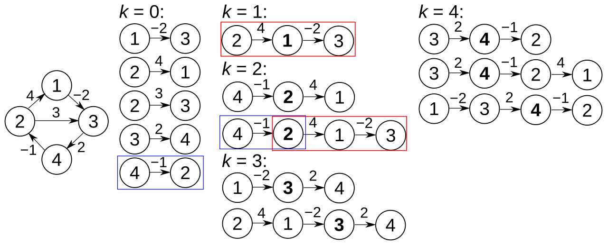

显然，它有三层循环，时间复杂度是 $O(|V|^3)$ 。

```c
for (int k = 0; k < n; k++) {
    for (int i = 0; i < n; i++) {
        for (int j = 0; j < n; j++) {
            dist[i][j] = min(dist[i][j], dist[i][k] + dist[k][j]);
        }
    }
}
```

### 从另一个视角理解Dijkstra算法

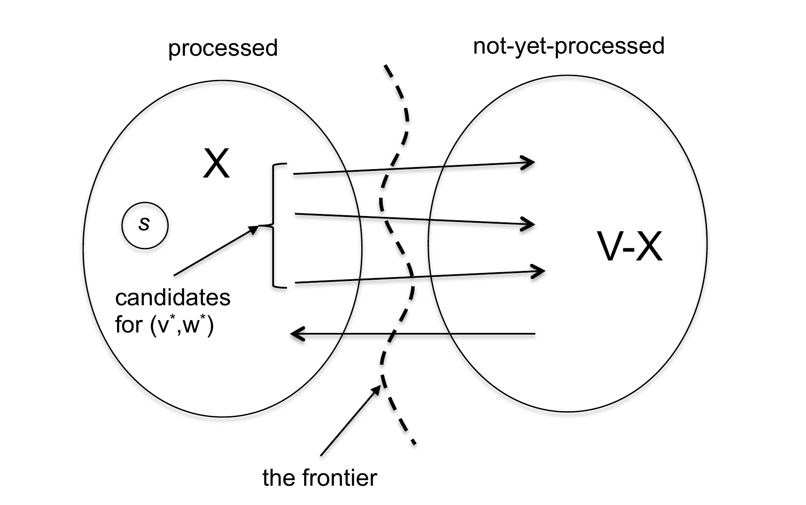

上面`processed`是加入到SPT树中的顶点集合，`unprocessed`是尚未加入SPT树的顶点集合。每次从`unprocessed`中选择一个顶点v加入到`processed`中，并且更新v的邻居节点的距离；而“选择“的标准就是选择`distTo[]`最小的顶点v。