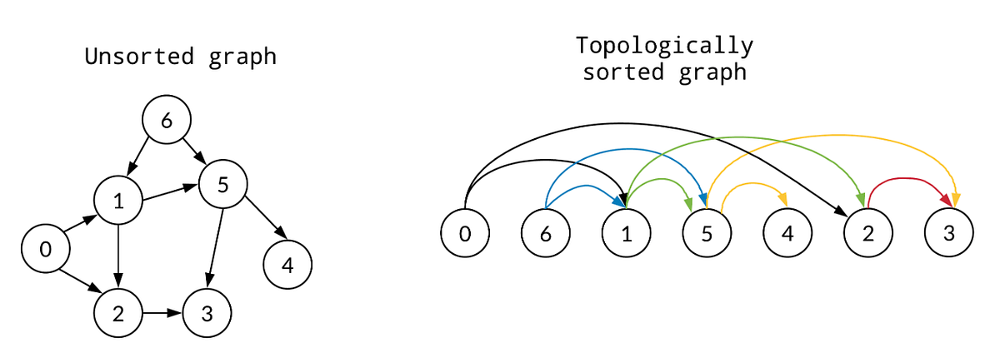

# 拓扑排序（Topological Sort）

对于有向无环图（DAG），拓扑排序是一种线性排序，使得对于图中的每一条有向边 $(u, v)$，顶点 $u$ 在 $v$ 之前出现。拓扑排序常用于任务调度、编译器优化等领域。



## 算法一
一个简单算法是：先找到入度为0的顶点，将其输出并从图中删除，然后更新剩余顶点的入度。重复这个过程直到所有顶点都被输出。

伪代码如下：

```
for (counter = 0; counter < V; counter++) {
    v = find_new_vertex_with_indegree_zero();
    if (v == null) {
        Error("Graph has a cycle");
        break;
    }
    TopOrder[v] = counter;
    for each vertex w adjacent to v {
        indegree[w]--;
    }
}
```

上面代码的时间复杂度是 $O(V^2)$，因为每次寻找入度为0的顶点需要遍历所有顶点。

## 算法二

一个优化的思路是更快地找到入度为0的顶点。可以使用Stack或Queue来存储入度为0的顶点，确保添加和删除操作的时间复杂度为 $O(1)$。

下面使用Queue实现的伪代码：

```
Queue Q = CreateQueue(V); // V是容量
for each vertex v in G{
    if (indegree[v] == 0) {
        Enqueue(Q, v);
    }
}

counter = 0;
while (!IsEmpty(Q)) {
    v = Dequeue(Q);
    TopOrder[v] = counter++;
    for each vertex w adjacent to v {
        indegree[w]--;
        if (indegree[w] == 0) {
            Enqueue(Q, w);
        }
    }
}
```

上面代码的时间复杂度是 $O(V + E)$。