# 第九章：查找

>[!NOTE]
> 本章的内容非常重要，比如《Algorithms》一书中：第二章sorting、第三章searching、第四章graphs。当然，从考试角度出发，本章的很多重点（如平衡树）被退化到简单概念理解，建议课程结束后继续深入学习。

## 9.1

平均查找长度（Average Search Length, ASL）是指在查找过程中，对所有元素进行查找时的平均比较次数。其中 $C_i$ 是第 $i$ 个元素的查找长度， $n$ 是元素总数。这实际上是进行**平均**时间复杂度分析，而我们之前为了简单起见，都是分析**最坏**情况的时间复杂度。

$$
ASL = \frac{1}{n} \sum_{i=1}^{n} C_i
$$

## 9.2

教材把用于查找运算的顺序表中的元素被定义成：

```c
typedef int KeyType;

typedef struct {
    KeyType key;
    InfoType data;    
} RecordType;
```

这意味着，元素包含两个部分：一个是关键字（`key`，也叫键），另一个是数据（`data`）。在查找过程中，我们通常只关注关键字，因为它是用来进行比较和定位的，具备唯一性；而数据部分则是与关键字相关联的信息。这里的`data`也经常被称为`value`，也叫`satellite data`，它是与关键字相关联的附加信息。

上述设计非常通用，上述定义除了能用在数组中，也可以用在链表中，甚至是树结构和哈希表中。无论数据结构如何变化，`key`和`data`的概念都是适用的：

- 描述学生信息中，`key`可以是学生的学号，而`data`可以包含学生的姓名、年龄、成绩等信息。
- 描述图书信息中，`key`可以是图书的ISBN号，而`data`可以包含图书的标题、作者、出版日期等信息。


>[!NOTE]
> 上述数据结构也被称为**关联数组**（associative array），它是一种将键（key）映射到值（value）的数据结构。多编程语言中都有实现，如Python中的字典（dict）等；特别地，后面提到的哈希表就是关联数组的一种常用实现。

9.2.1考虑的是顺序表，思考：对于链表，其 $ASL_{成功}$ 和 $ASL_{失败}$ 分别是什么？

9.2.2的二分/折半查找（binary search）非常经典。1）理解代码实现机制；2）理解时间复杂度分析；3）理解`例9.1`。

```c
int binary_search(int a[], size_t N, int target) {
  int low = 0;
  int high = N - 1;
  while (high >= low) {
    int mid = low + (high - low) / 2;
    if (a[mid] == target)
      return mid;
    else if (a[mid] > target)
      high = mid - 1;
    else
      low = mid + 1;
  }
  return -1;
}
```

```c
static int search(int a[], int low, int high, int target) {
  if (low > high)
    return -1;
  int mid = low + (high - low) / 2;
  if (a[mid] == target)
    return mid;
  else if (a[mid] > target)
    return search(a, low, mid - 1, target);
  else
    return search(a, mid + 1, high, target);
}

int binary_search(int a[], size_t n, int target) {
  return search(a, 0, (int)n - 1, target);
}
```

> 当 Jon Bentley 在面向专业程序员的课程中布置“二分查找”这一练习题时，他发现：尽管学生们花费了数小时时间来完成任务，仍有 90% 的人未能提供正确的解决方案。主要原因是他们的实现方式存在缺陷——在某些罕见的 边界情况 下，这些实现要么无法正常运行，要么会返回错误的答案。一项发表于 1988 年的研究显示：在 20 本编程教材中，只有 5 本真正提供了正确的二分查找算法实现。更令人担忧的是：Bentley 自己在 1986 年出版的书籍 《编程珠玑》 中提供的二分查找算法实现中存在一个严重的错误（即“溢出错误”），这个缺陷竟然被忽视了超过二十年；Java 编程语言的标准库中实现的二分查找算法也存在同样的溢出问题，并且这个问题同样被忽视了九年多时间。https://en.wikipedia.org/wiki/Binary_search#History

```c
#include <stdint.h>
#include <stdio.h>
int main() {
  int max = INT32_MAX;
  printf("INT32_MAX: %d\n", max); // 2147483647
  printf("INT32_MAX + 1: %d\n", max + 1); // -2147483648
  return 0;
}
```

此外，严格意义上，例9.1的（3）的*查找不成功的时的平均查找长度*必须再引入一个前提：**每个失败的区间概率相同**，而不仅仅是**每个元素的概率相同**。

9.2.3的分块查找的重点是：**块内使用顺序查找，块间使用二分查找**。

## 9.3

“树表的查找“。But，tree is tree, table is table，我没有见过“树表”的提法。另外，在计算机的语境中，`table`一词一般暗示它是基于数组的某种实现，比如后面提到的哈希表。

### 9.3.1 
Binary Search Tree（BST），一般被称为二叉搜索树。像教材中翻译的“二叉排序树”并不主流。BST的可视化参考：https://bst.zhongpu.info/

这里的重点是理解BST的性质：

>[!NOTE]
> 令x是BST的一个结点。如果y是x的左子树中的一个结点，那么y.key < x.key；如果z是x的右子树中的一个结点，那么z.key > x.key。

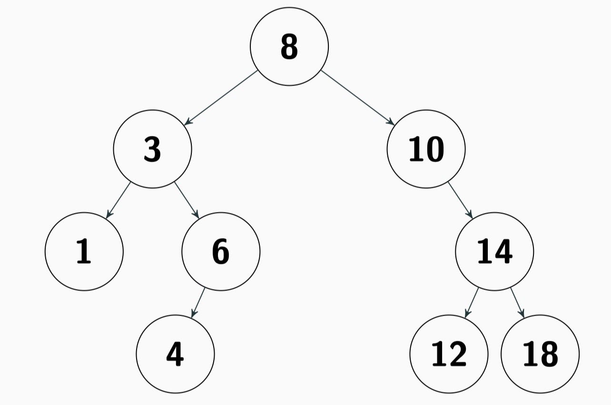

不难发现，BST的中序遍历结果是一个有序序列。

#### (1) 查找（类似binary search的过程）

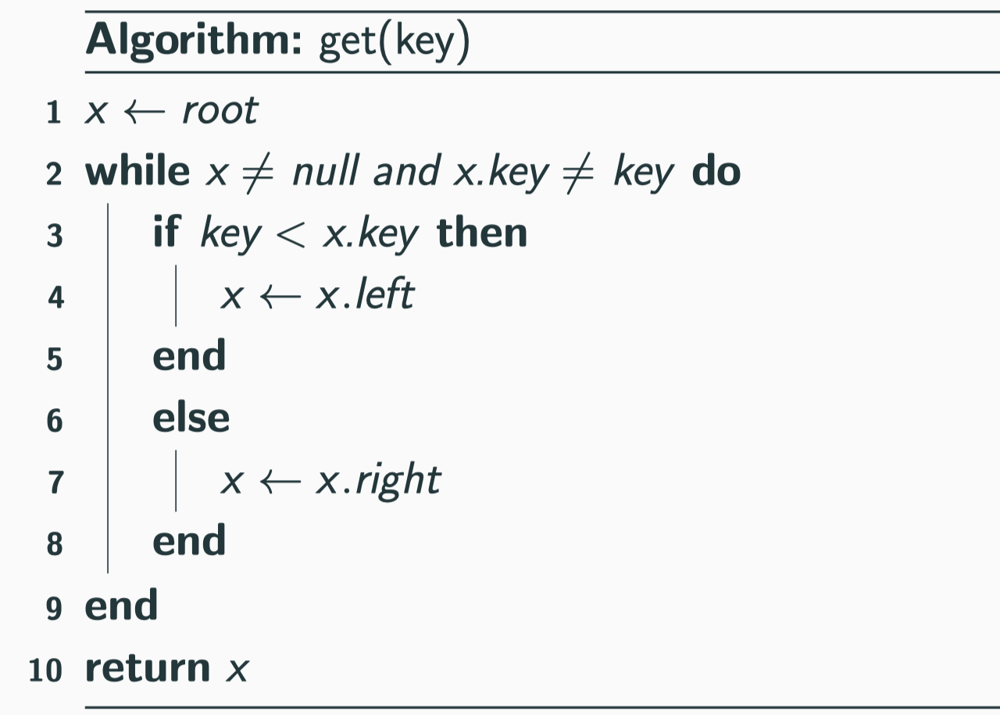

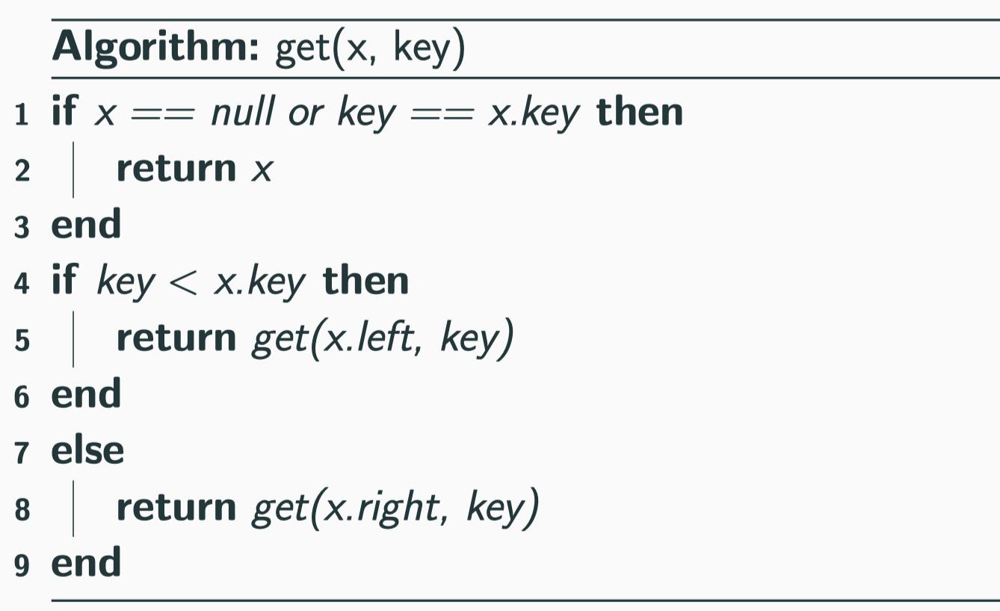

#### (2) 插入

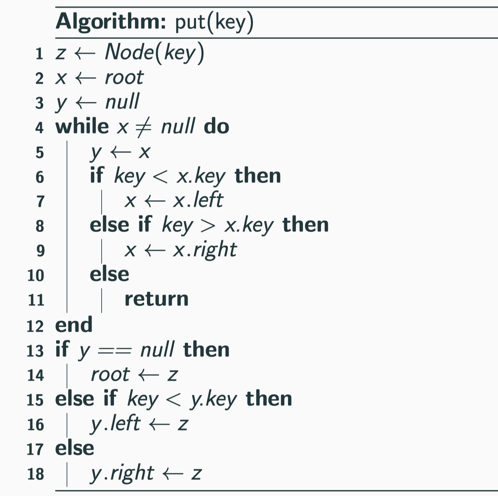

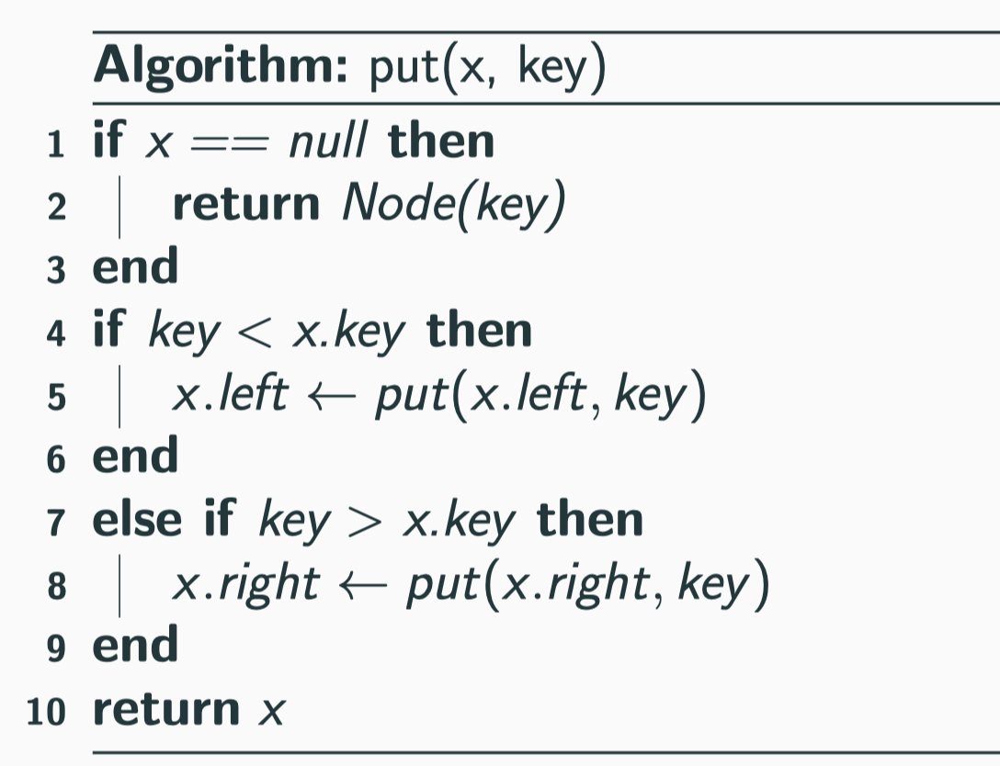

#### (3) 删除

`remove(x)`是从删除结点x，并返回新的根。

- 第一种情况：x没有子结点，直接删除即可（返回NULL）。
- 第二种情况：x有一个子结点，直接用子结点替换x即可（返回子结点）。
- 第三种情况：x有两个子结点，找到x的后继结点y（即x的右子树中的最小结点），用y替换x，然后删除y。

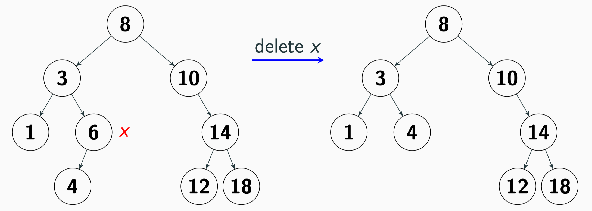

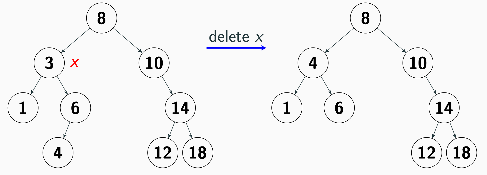

思考：对于第三种情况，还有哪些替代方案？

```python
def remove(self, key):
    def _remove(x: BST.Node):
        if x is None:
            return None
        if key < x.key:
            x.left = _remove(x.left)
        elif key > x.key:
            x.right = _remove(x.right)
        else:
            if x.right is None:
                return x.left
            if x.left is None:
                return x.right
            t = x
            x = BST._min(t.right)
            x.right = BST._remove_min(t.right)
            x.left = t.left
        return x
    self._root = _remove(self._root)
```

### 9.3.2

不难发现，BST的主要操作（如查找、插入、删除）的时间复杂度取决于树的高度；而它有可能退化成一个链表。

对于平衡树，下面是其非正式定义：

> A search tree is balanced if the height is guaranteed to be log(⁡N).

一个常见的误解是把平衡树直接定义理解成**左右子树高度差不超过1**，但这只是AVL树的定义，而不是平衡树的定义。平衡树的定义更宽泛，AVL树只是其中的一种实现。但在考试中，平衡树的定义一般被退化成了AVL树的定义。

下面仅考虑AVL树。可以证明：AVL树的高度不超过O(log N)。

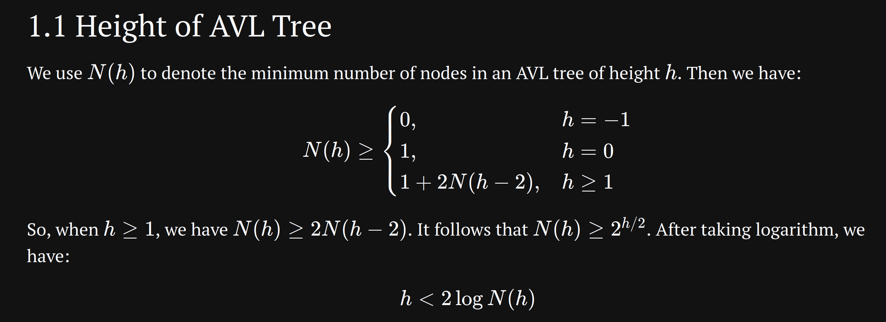

思考：AVL的`get()`操作和普通BST的`get()`是否有区别？那么添加呢？


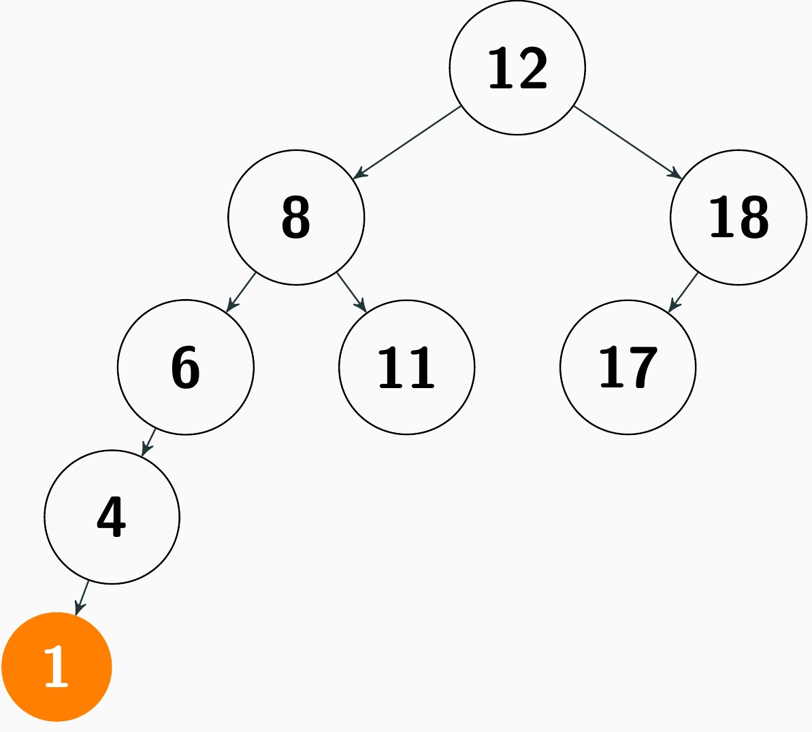

> Modifying an AVL tree may violate the balance property, so we need to **rebalance** the tree.

平衡操作的核心是**旋转**（rotation）。旋转分为左旋和右旋两种；显然，旋转能保持BST的性质不变。

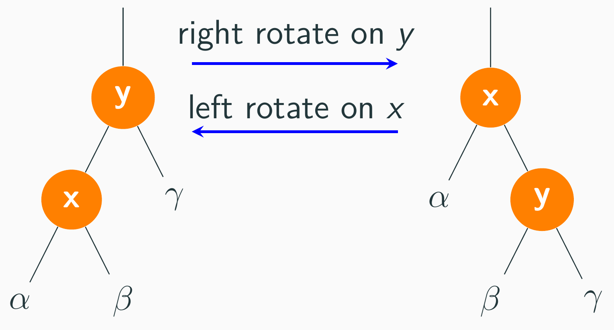

```python
def _right_rotate(y: Node):
    x = y.left
    y.left = x.right
    x.right = y
    y.height = max(AVL._get_height(y.left),
                   AVL._get_height(y.right)) + 1
    x.height = max(AVL._get_height(x.left),
                   AVL._get_height(x.right)) + 1
    return x
```

> 当平衡因子（BF）是2或-2的时候，进行旋转。

#### （1）LL型

> bf(x) = 2, key < x.left.key，在x上右旋转


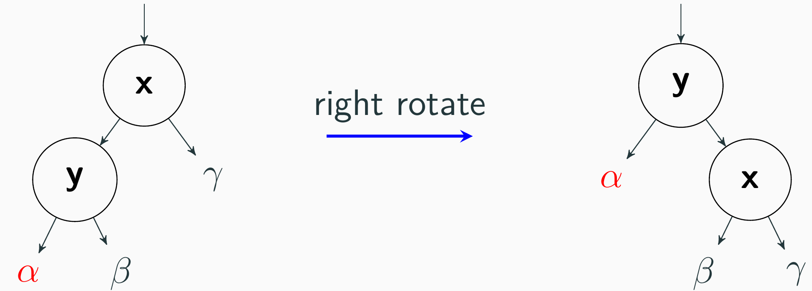

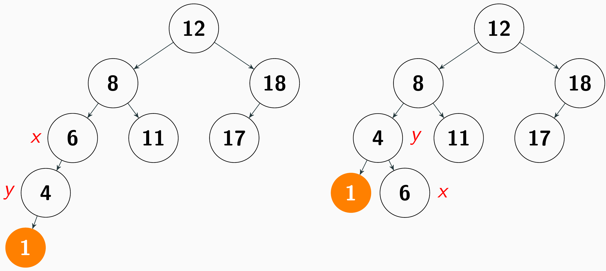

#### （2）RR型

> bf(x) = -2, key > x.right.key，在x上左旋转

#### （3）LR型

> bf(x) = 2, key > x.left.key，在x.left上左旋转，在x上右旋转

不难发现，在 `x.left` 上左旋转后，变成了LL型。

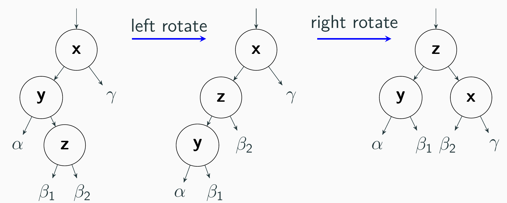

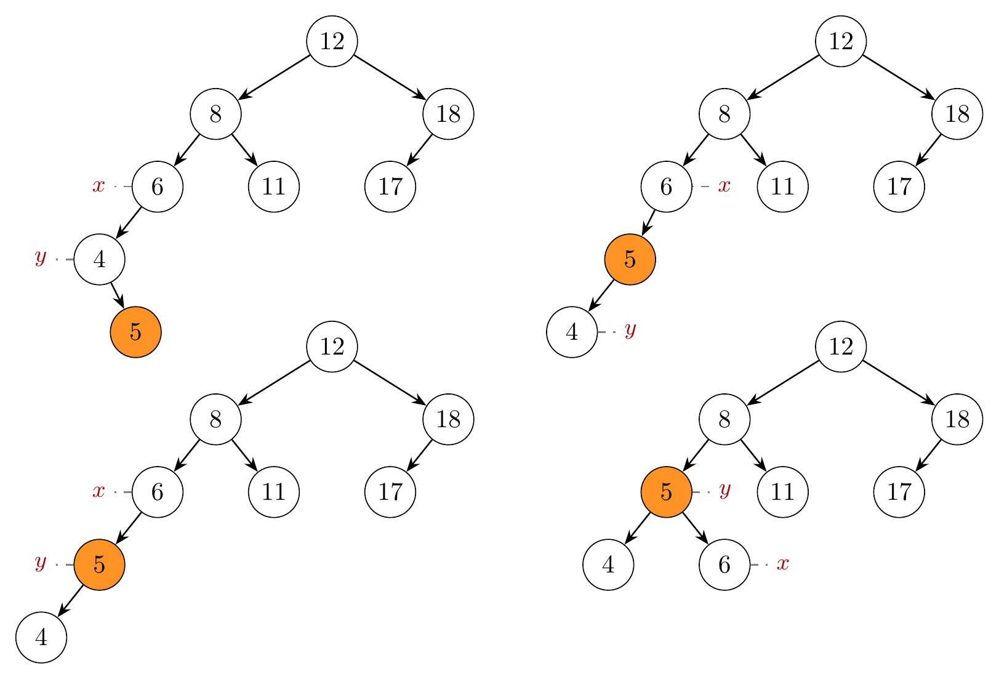


#### （4）RL型

> bf(x) = -2, key < x.right.key，在x.right上右旋转，在x上左旋转

不难发现，在 `x.right` 上右旋转后，变成了RR型。 

## 9.4
这是本节的重点。

哈希表（Hash Table）是一种基于数组实现的数据结构，它通过一个哈希函数将键映射到数组的索引位置，从而实现快速的查找、插入和删除操作。哈希表的核心思想是利用哈希函数将键转换为数组索引，以便在常数时间内访问数据。

> A hash function is any function that can be used to map data of arbitrary size to fixed-size values.

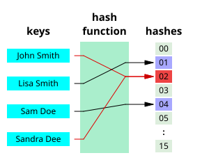

在这里，我们总是认为哈希函数的结果是对应数组的索引位置；而这个位置一般被称为 **slot** 或 **bucket**。哈希函数 $h$ 将全集 $U$ 的键映射到一个范围为 $[0, M -1]$ 的整数集合，其中 $M$ 是哈希表的大小。

如何设计一个好的哈希？一个好的哈希函数应该满足以下几个条件（只有最后一个是必须的）：
1. **均匀分布**：哈希函数应该能够将键均匀地分布在哈希表的各个槽位上，避免过多的碰撞。
2. **快速计算**：哈希函数应该能够在常数时间内计算出键的哈希值，以保证哈希表的高效性。
3. **单向性**：哈希函数应该具有单向性，即很难从哈希值反推出原始键，以增强安全性。
4. **确定性**：对于相同的输入，哈希函数应该始终返回相同的输出，以确保哈希表的正确性。

对于复杂场景，好的哈希函数的设计可能非常困难。对考试场景，它一般都是对 $M$ 取模（取余数）。

一般来说， $M$ 远远小于 $|U|$ ，因此哈希函数会将多个键映射到同一个索引位置，这种现象被称为**碰撞** 或 **冲突**（collision）。在教材中，把这些冲突的关键字称为“同义词”。处理碰撞的方法被称为**冲突消解**（Collision Resolution）有很多，其中最常见的两种是**拉链法**（Separate Chaining）和**开放地址法**（open addressing）。


### 拉链法（Separate Chaining）

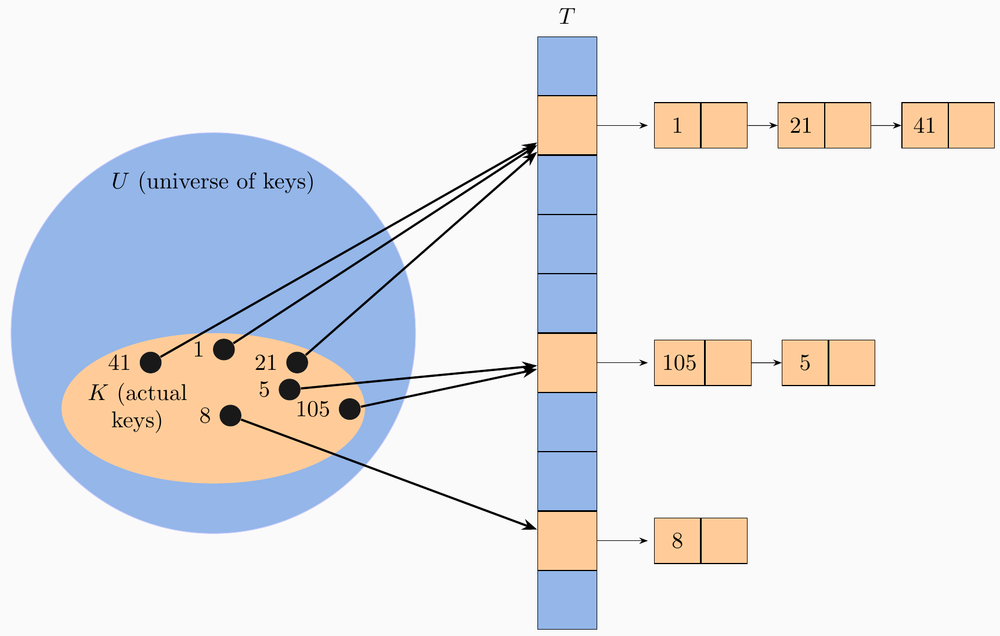

也被称为**链地址法**，它的核心思想是：每个槽位（bucket）都维护一个链表（或其他数据结构）来存储所有映射到该槽位的键值对。当发生碰撞时，新元素被添加到对应槽位的链表中。

>[!NOTE]
> 从考试角度，如果没有特殊说明，我们认为它使用链表；但在实际应用中，也可以使用其他数据结构（如平衡树）来存储同一个槽位的元素，以提高查找效率。这个和图表示的邻接表类似：*list can be a linked list, but it can also be other data structures, such as a balanced tree*.

在哈希表中，有个重要的参数叫做**负载因子**或装填因子（load factor），它是哈希表中元素的数量与哈希表大小的比值，通常用 $\alpha = \frac{N}{M}$ 表示，其中 $N$ 是哈希表中元素的数量， $M$ 是哈希表的大小。负载因子反映了哈希表的使用程度，较高的负载因子可能导致更多的碰撞，从而降低查找效率。

不难发现，在理想情况下（即uniform hash assumption），此时哈希表查找的平均复杂度是 $O(1 + \alpha)$ 。


>[!TIP]
> 哈希函数能够将键均匀地（且独立地）分布在哈希表的各个槽位上。


拉链法下， $ASL_{成功}$ 的计算比较简单，分母是元素的个数N； $ASL_{失败}$ 不考虑空指针判断情况，因此仅仅考虑遍历list但找不到的情况，分母是哈希表的大小M（M也是哈希值可能的个数）。

### 开放地址法

开放地址法的核心是所有的元素都存储在哈希表的数组中，当发生碰撞时，通过探测（probing）寻找下一个可用的槽位来存储元素。常见的探测方法有线性探测、平方探测和双重哈希等。 

这里的“开放”（open）指的是：*every slot is open to store an element*. 通用表达式是：

$$
h_i(x) = \text{hash}(x) + F(i)
$$

- 线性探测，即 $F(i)$ 是关于 $i$ 的线性函数，如 $F(i) = i$ 。
- 平方探测，即 $F(i)$ 是关于 $i$ 的二次函数，如 $F(i) = i^2$ ；教材中那种交替使用正负号只是平方探测的一种特殊实现。

比如，下面 $h(x) = x \% 10$ ，如果实现线性探测，那么28的位置在哪？

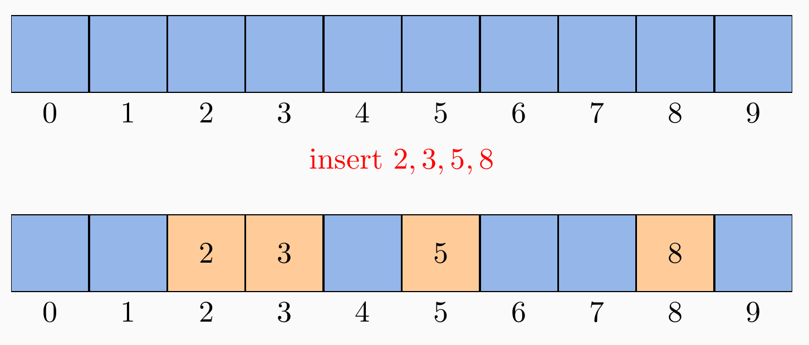

开放地址下， $ASL_{成功}$ 比较简单，就是考虑每个元素在哈希的过程中探测的次数，分母是元素的个数N；而 $ASL_{失败}$ 则需要考虑在从hash(x)开始直到遇到空槽位的过程中探测的次数（**空槽比较也算一次**），分母是哈希值的可能个数（**它可能小于M**）。（参考教材例 9.11）

由于开放地址法遇到空槽位就停止，所以在删除的操作的时候，有必要移动元素来保证哈希表的连续性（参考教材 P.356 的 表9.2和表9.3）。还有一种方案是：**将被删除的元素标记为“已删除”**，而不是直接删除，这样在查找过程中可以继续探测下去，但在插入过程中可以覆盖这个“已删除”的位置。（参考 2023 年考研第 9 题）

### 一些公式推导

>[!NOTE]
> 教材中表9.6（P.362）的公式部分仅仅是理论（近似结果），不适合具体哈希过程的计算。

#### （1）拉链法下不成功查找的ASL是 $\alpha$

假设查找一个不存在的关键字x，设h(x) = j。显然，其查找长度是链表 $L_j$ 的长度；而在理想情况下，链表 $L_j$ 的长度是 $\alpha$ ，因此不成功查找的ASL是 $\alpha$ 。

那么，教材中为什么是 $\alpha + e^{-\alpha}$ 呢？这是因为，它进一步考虑了链表为空的情况（不是非空链表的最后空指针判断）。在简单均匀哈希假设下，每个关键字不在某指定链表的概率是 $ 1 - \frac{1}{M}$ ，那么N个关键字均不在该链表的概率是：

$$
(1 - \frac{1}{M})^N \approx e^{-N/M} = e^{-\alpha}
$$

那么，查找代价就是：

$$
C =
\begin{cases}
1, & L = 0 \\
L, & L > 0
\end{cases}
$$

因此，不成功查找的ASL是：

$$
E[C] = E[L] + P(L=0) = \alpha + e^{-\alpha}
$$

#### （2）拉链法下成功查找的ASL是 $1 + \alpha / 2$

考虑存在的关键字 $x$ ，除了它之外，还有 $N - 1$ 个关键字。那么，和 $x$ 冲突的关键字数量是 $\frac{N-1}{M}$ 。

从平均意义上，和 $x$ 冲突的关键字中，有一半在 $x$ 之前，另一半在 $x$ 之后。因此，成功查找的ASL是：

$$
1 + \frac{N-1}{M} \cdot \frac{1}{2} \approx 1 + \frac{\alpha}{2}
$$

#### (3) 线性探测呢？

按《Algorithms》一书的说法，

> Despite the relatively simple form of the results, precise
analysis of linear probing is a very challenging task.

### 应用

哈希表是一种基础数据结构，在主流编程语言中都有内置实现，如Python中的字典（`dict`）、Java中的`HashMap`、C++的`unordered_map`等。哈希表广泛应用于各种场景，如数据库索引、缓存系统、符号表等。

C++的`ordered_map`是基于红黑树实现的。

## 锐评ASL

从考试角度，理解并能够计算ASL非常重要。但实际上，这个概念在主流英文教学中很少出现，它们更倾向直接说“成本”是什么，而不是打包在一个ASL概念里面：

| 中文 ASL      | 英文更常见表达                                                         |
| ----------- | --------------------------------------------------------------- |
| 平均查找长度      | average number of comparisons                                   |
| 哈希查找成功 ASL    | average probes for a search hit                                 |
| 哈希查找失败 ASL    | average probes for a search miss                                |
| BST 查找成功 ASL  | average depth / average number of comparisons                   |
| BST 查找失败 ASL | average external path length / average unsuccessful search cost |


